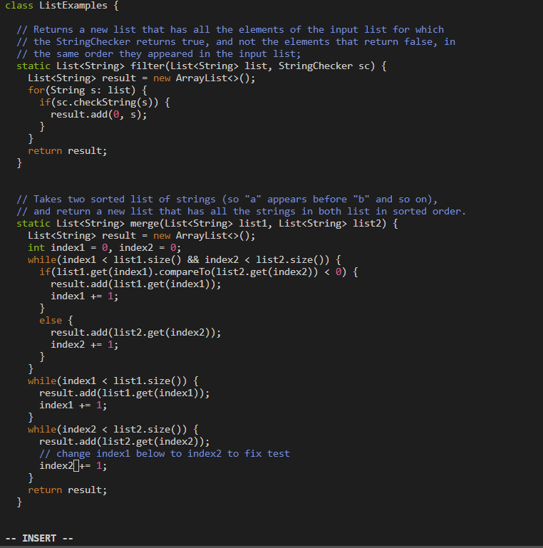
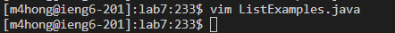
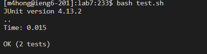
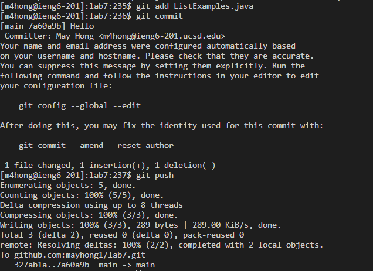

## Step 4:

All keys pressed: s s h `<space>` m 4 h o n g @ i e n g 6 . u c s d . e d u `<enter>`

Summary: To log into ieng6, I used the ssh command which allows the user to connect to a remote machine. I logged in to ieng6 with my username, m4hong@ieng6.ucsd.edu. All my key presses were to type the correct command.

## Step 5:

All keys pressed: g i t `<space>` c l o n e `<space>` `<ctrl>`+v

Summary: I used the git clone command to clone my forked repository of lab 7. I did `<ctrl>`+v to paste in the ssh link, which was on my clipboard.

## Step 6:

All keys pressed: c d `<space>` l `<tab>` `<enter>` b a s h `<space>` t `<tab>` `<enter>`

Summary: First, I changed the working directory to lab7. After having "cd l" in my command line, I pressed `<tab>` which autofilled to "lab7". Then, I ran the "bash test.sh" command in order to run the tests. After typing in "bash t" in the command line, I then pressed `<tab>` to autofill the command line to say "bash test.sh".

## Step 7:

This image shows what happened after I ran "vim ListExamples.java". The cursor was already on the correct spot that I needed to change. I'm nto sure why, but I think it's because last time I opened vim, I left my cursor on that spot.

This image shows what happens after I saved my changes and exited vim.

All keys pressed: v i m `<space>` L i `<tab>` . j `<tab>` `<enter>` i 2 `<right>` `<backspace>` `<escape>` : w q `<enter>`

Summary: First, I ran the command "vim ListExamples.java" because that would open the vim editor for the ListExamples.java file, allowing me to make edits. To do this, I first enter "vim Li" and then hit `<tab>` for it to autofill to "vim ListExamples". I then modifed that to "vim ListExamples.j" and hit `<tab>` again, autofilling the line to be "vim ListExamples.java". I then hit `<enter>` to run the command, opening the file in vim. Once in vim, I pressed i to enter insert mode, which allows me to make changes to the file. The cursor was already on the "1" in "index2" on the line that I was supposed to edit, so I didn't need to use any arrow keys to navigate. As stated previously, I'm not sure why my cursor was already on the correct spot that I needed to change, but I suspect it's because the last time I opened vim I had left my cursor at that spot. I think entered "2" to add a 2 and used the `<right>` key to move the cursor on to the right. I then hit `<backspace>` to delete the 1, which makes the modification of turning "index1" to "index2". I then hit `<escape>` to ensure that I was in normal mode, and then entered ":wq" to save my edits.

## Step 8: 

All keys pressed: `<up>` `<up>` `<enter>`

Summary: I wanted to run "bash test.sh" because that is the file that runs the test cases. It was the second most recent command that I ran, so I hit the up arrow twice, which gave me the command "bash test.sh"

## Step 9:

All keys pressed: g i t `<space>` a d d `<space>` L i `<tab>` `<enter>` 9 `<down>` `<down>` `<enter>` i H e l l o `<escape>` : w q `<enter>` g i t `<space>` p u s h `<enter>` 

Summary: First, I wanted to run the command "git add ListExamples.java" in order to include "ListExamples.java" to the commit>. To do this, I entered "git add Li" and then pressed `<tab>` which autofilled the command to "git add ListExamples.java". When I hit enter, that then opened a vim editor system where I was to include my commit message. I hit 9 and then `<down>` to move down 9 lines, then hit `<down>` again to be on the 10th line. I then hit `<enter>`, which moved my cursor to the area where the commit message should go. I then hit "i" to go into insert mode so I could make changes, and typed the word "Hello", which is my commit message. I think hit `<escape>` to ensure that I was in normal mode, then typed in ":wq" to save my changes to the file. Then, I ran the command "git push" to finally push my changes into github.
