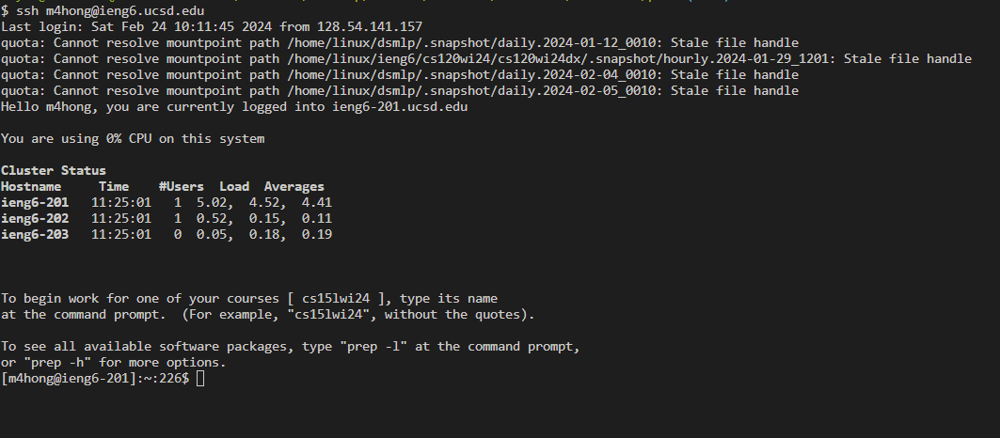
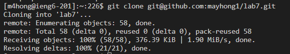
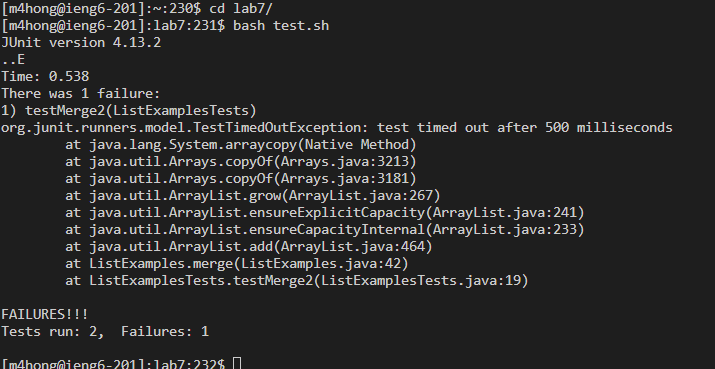

# Part 1 - Debugging Scenario

### Original Post:
Help! I git cloned code from https://github.com/ucsd-cse15l-f23/chat-server/blob/main/test.sh and made a few modifications. I'm trying to run my bash script which runs tester cases for my program, but when I run it I get errors. Below, I've attached screenshots of the command-line output, my bash script, and my code for the test cases. According to the command line, it is the import statements inside my HandlerTests.java file that is causing these errors (all the subsequent errors are because the libraries weren't properly imported). However, I've quadruple-checked those import statements and they are correct according to the official JUnit documentation. TAs please help me!!!!

Command-line output:

My bash script:

Code for the test cases:

# Part 2 - Reflection

I didn't know that you could edit files from just a command line. In fact, you can do basically anything from just the command line, which I found really cool! I can now make a program without a code editor. I also learned how to create a bashscript, which I also found exciting because I didn't know that you could group together commands like that. Overall, a bashscript makes life easier which will probably be helpful for the future.
