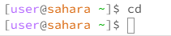
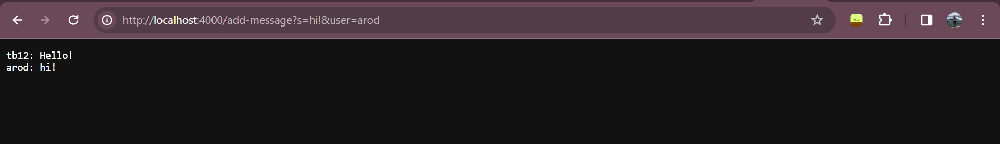
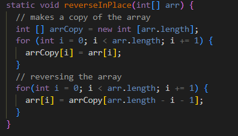
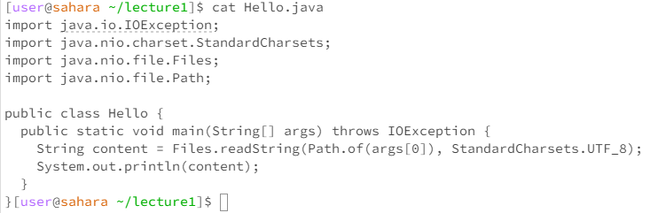
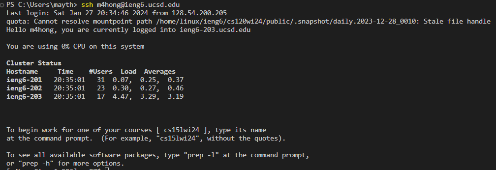

# Part 1
## Here is my code for ChatServer!

```
import java.io.IOException;
import java.net.URI;
import java.util.ArrayList; 

class Handler implements URLHandler {
    ArrayList<String> words = new ArrayList<String>();
    ArrayList<String> names = new ArrayList<String>();
    String errorString = 
    "Invalid format. Format is /add-message?s=<string>&user=<string>";

    public String handleRequest(URI url) {
        if (url.getPath().contains("/add-message")) {
            // try this and catch if its not possible
            // split int s, Hello&user, jpolitx
            String [] parameters = url.getQuery().split("=");
            if (!parameters[0].equals("s") || parameters.length != 3 || 
            !parameters[1].contains("&user")) {
                return String.format("%s", errorString);
            }
            
            parameters[1] = parameters[1].substring(0, parameters[1].length() - 5);
            words.add(parameters[1]);
            names.add(parameters[2]);
        }
        String finalString = "";
        for (int i = 0; i < words.size(); i ++) {
            finalString += names.get(i) + ": " + words.get(i) + "\n";
        }
        if (finalString.length() != 0) {
            return finalString;
        }
        if(url.getPath().equals("/")) {
            return finalString;
        }
        return "Page not found";
        //return "Page not found";
    }
}

class ChatServer {
    public static void main(String[] args) throws IOException {
        if(args.length == 0){
            System.out.println("Missing port number! Try any number between 1024 to 49151");
            return;
        }

        int port = Integer.parseInt(args[0]);

        Server.start(port, new Handler());
    }
}

```

## ChatServer Usage



The `handleRequest` method was called. The argument was the uri, which is `http://localhost:4000/add-message?s=Hello!&user=tb12`. Two relevant fields of the class are `words` and `names`, which are the ArrayLists that hold all the messages and usernames that were inputted using `/add-message`. The message, which was "Hello!", was added as the first element to `words`. The username, which was "tb12", was added as the first element to `names`. Another relevant field is `errorString`, which is the string that holds the message that would be displayed in case of an error. This field does not change because it isn't updated whenever there is a new input; it's meant to stay the same. 



Similar to the first screenshot, the `handleRequest` method was called. However, the argument is different as this screenshot contains a different uri. Here, it is `http://localhost:4000/add-message?s=hi&user=arod`. Like in the first screenshot, the relevant fields are `words`, `names`, and `errorString`. The message of "hi" gets added as the second element to `words` as the message in the first screenshot occupies the spot as the first element. The username of "arod" is added as the second element to `names` with the username in the first screenshot being the first element. `errorString` remains the same as it isn't updated anywhere in the code.

# Part 2


The image above shows the absolute path for the private key. It is the file `id_rsa`.



The image above shows the absolute path for the public key in ieng6. It is contained in the `authorized_keys` file because that is where I copied the public key to. If you perform `cat` on `authorized_keys`, you can see that it contains the public key. 



The image above showscases me logging into my ieng6 account with the need for a password

# Part 3
I learned a lot from lab in week 2! I learned how to create a server in Java, which is something that I've never done before. Additionally, I learned how to send inputs to a server using the uri.
