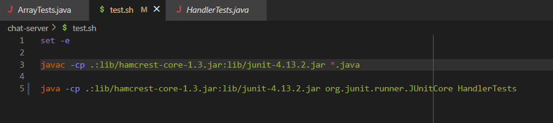
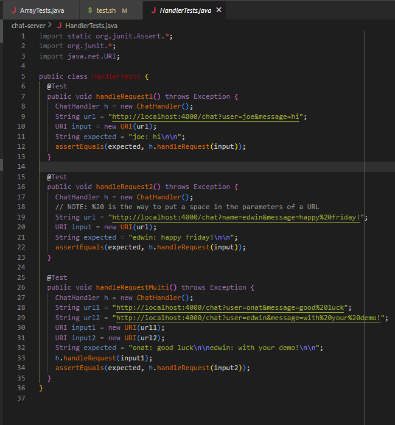

# Part 1

## Failure Inducing & Non-Failure Inducing Input:

```
import static org.junit.Assert.*;
import org.junit.*;

public class ArrayTests {
  // this test induces failure
  @Test
  public void testReverseInPlace1() {
    int [] input = {1, 2, 3, 4};
    int [] expected = {4, 3, 2, 1};
    ArrayExamples.reverseInPlace(input);
    assertArrayEquals(expected, input);
  }
  // this test does not induce failure
  @Test
  public void testReverseInPlace() {
    int [] input = {3, 2, 2, 3};
    int [] expected = {3, 2, 2, 3};
    ArrayExamples.reverseInPlace(input);
    assertArrayEquals(expected, input);
  }

}
```

##The symptom:


## The bug:

### Before Fixing:


### After Fixing:


In the before screenshot, the values in the array were being directly modified. Once `i` reached `arr.length/2`, the first half of the array has been modified. So, when you set the values in the second half of the array to the values in the first half of the array, those values are the modified values (not the original values), resulting in the bug. To fix this, you could create a copy of the array. Then, in each iteration of the loop you would set `arr[i]` to `arrCopy[arr.length - 1 - i]`; in this version, the values are the original values because you are setting it to an original version of the array and not a modified version.

# Part 2
