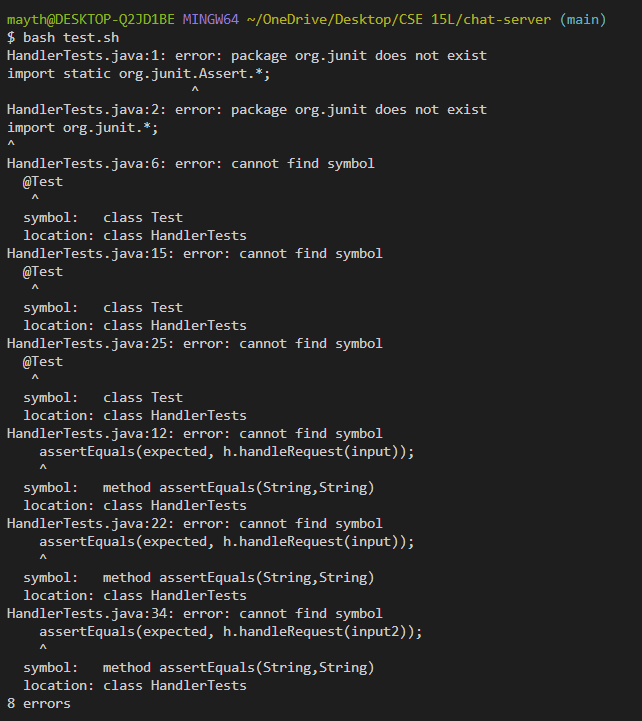

# Part 1 - Debugging Scenario

### Original Post:
Help! I git cloned code from https://github.com/ucsd-cse15l-f23/chat-server/tree/main and made a few modifications. I'm trying to run my bash script which runs tester cases for my program, but when I run it I get errors. Below, I've attached screenshots of the command-line output, my bash script, and my code for the test cases. According to the command line, it is the import statements inside my HandlerTests.java file that is causing these errors (all the subsequent errors are because the libraries weren't properly imported). However, I've quadruple-checked those import statements and they are correct according to the official JUnit documentation. TAs please help me!!!!

Command-line output:

My bash script:

Code for the test cases (HandlerTests.java):

### TA Reply:

Hey! According to the command-line output, the java compiler is saying that it can't find the JUnit library (hence, the message that it doesn't exist). A common cause for this is that the path to the JUnit JAR files is incorrect in the classpath (-cp) argument. Check to make sure that the path you inputted as arguments are correct. It seems that you are using a Window system whereas the code in the github repo was designed for a Unix-based system, maybe look into that. Let me know if you need any more help!

### Student Reply:

Hi! I fixed the code, the bash script is able to run successfully now. Basically, the paths in my bash script were formatted to work on a Unix-based system and not a Windows one. Since I am on Windows, in my test.sh file I modified the paths to use ";" instead of ":" and to have quotation marks around the paths, which would be the correct format for a Windows-based system. Thanks for the help! Here is my output now, which is my expected output.

### Setup Info:

The file & directory structure needed & the contents: all the code from https://github.com/ucsd-cse15l-f23/chat-server/tree/main, except there are a few modifications to the the test.sh file which should look like this:

The full command line (or lines) you ran to trigger the bug: bash test.sh

A description of what to edit to fix the bug: In the test.sh file, modify the paths to use ";" instead of ":" and have quotation amrks around the paths. The file should look like this:

# Part 2 - Reflection

I didn't know that you could edit files from just a command line. In fact, you can do basically anything from just the command line, which I found really cool! I can now make a program without a code editor. I also learned how to create a bashscript, which I also found exciting because I didn't know that you could group together commands like that. Overall, a bashscript makes life easier which will probably be helpful for the future.
