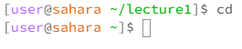
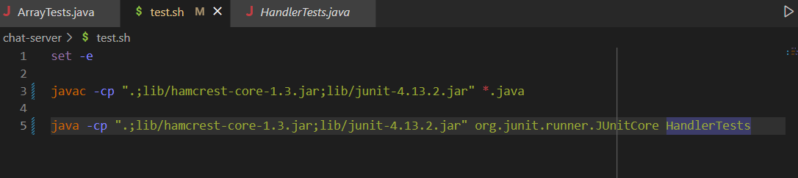
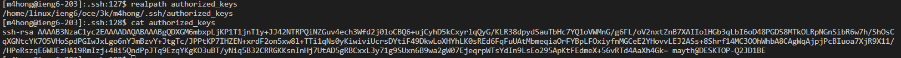

# Lab Report 1 

This lab report is about the commands cd, ls, and cat

## Here are some examples of the command cd

**no arguments**

	

Working directory: /home/lecture1

Since there is no argument, the cd command by default switches the current working directory to the home directory. Hence, the current working directy becomes /home. There is no error.

**path to a directory as an argument**

	

Working directory: /home/lecture1

The current directory is switched from /home to /home/lecture1. This happens because the cd command switches the current working directory to the argument (should be a path), which is lecture1. There is no error.

**path to a file as an argument**

	

Working directory: /home/lecture1

The cd command switches the current working directory to the argument. An error occurs because the argument isn't a path to a directory, so the command therefore doesn't work. 

## Here are some examples of the command ls

**no arguments**

	

Working directory: /home

The argument for the ls command should be a path, and the output should be a list of the files and folders in the path. Since there is no argument, the files in the current working directory are listed, which is just the lecture1 folder. There is no error.

**path to a directory as an argument**

	

Working directory: /home

All the files in the lecture1 folder are listed because the ls command lists all the files in the given path, which in this case would be the lecture1 folder as that is the arguement. There is no error.

**path to a file as an argument**

	

Working directory: /home/lecture1

Hello.java is listed because that is the only file that is in the /home/lecture1/Hello.java path. There is no error. 

## Here are some examples of the command cat

**no arguments**

	

Working directory: /home

Cat prints out the contents of the file that is in the path of the argument. Since there is no argument, there are no contents to print out, so an error occurs. Here, the terminal is stuck running forever because cat is supposed to print out contents but there's nothing to print out.

**path to a directory as an argument**

	

Working directory: /home

Cat is meant to print the contents of a file. In this case, the argument is a path to a directory, not a file, so an error occurs.

** path to a file as an argument **
	
Working directory: /home/lecture1

The content of the file Hello.java is printed because the cat command prints the contents of the file of the given path, which in this case is /home/lecture1/Hello.java. There is no error.
